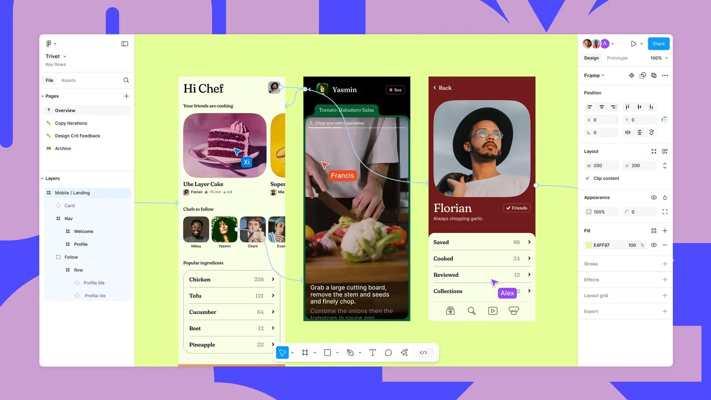
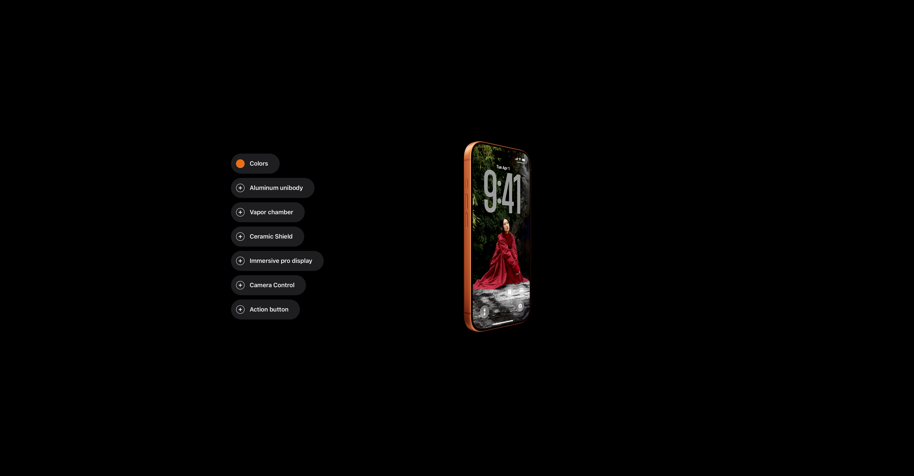
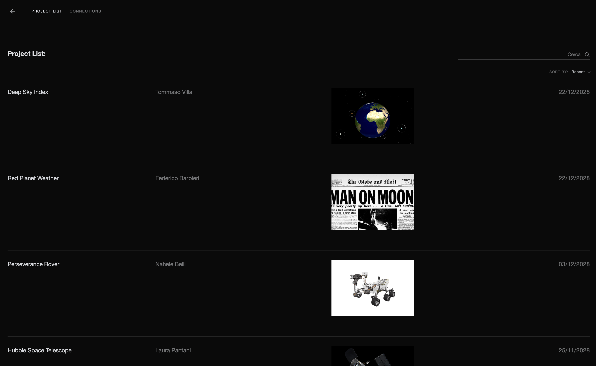

¨SUPSI 2026  
Corso d’interaction design, CV429.01  
Docenti: A. Gysin, G. Profeta  

Progetto 1: NASA 70 Archive

# Spacesuit evolution
Autore: Davide Barattini \
[NASA 70](https://davidebarattini.github.io/NASA70/)


## Introduzione e tema
NASA 70 Archive è una piattaforma web progettata per celebrare il settantesimo anniversario della NASA attraverso una raccolta di progetti realizzati a partire dagli archivi digitali dell'agenzia spaziale.
L'obiettivo del progetto è offrire un sistema di esplorazione che permetta agli utenti di scoprire relazioni tra contenuti diversi, superando una semplice organizzazione cronologica o alfabetica.
Attraverso l'utilizzo di tag e connessioni semantiche, la piattaforma mette in evidenza i legami esistenti tra i progetti, consentendo di navigare l'archivio seguendo temi, tecnologie, missioni e argomenti condivisi.
Il progetto trasforma quindi l'archivio in una rete di conoscenze interconnesse, favorendo una modalità di scoperta libera e non lineare.


## Riferimenti progettuali
[]()
[]()
[]()\
Per la progettazione dell'interfaccia sono stati presi come riferimento diversi prodotti digitali esistenti.
Apple ha ispirato il sistema di hotspot interattivi, utilizzati per evidenziare e approfondire specifici elementi delle tute spaziali direttamente all'interno della visualizzazione.
Figma e Framer hanno invece influenzato la struttura dell'interfaccia, basata su un layout a tre colonne che separa navigazione, contenuto principale e pannello di approfondimento, favorendo un'esplorazione chiara e organizzata delle informazioni.


## Design dell’interfaccia e modalità di interazione
L'esperienza è suddivisa in due modalità principali.\
[Archivio]
La prima schermata presenta tutti i progetti sotto forma di archivio consultabile.
Ogni progetto include:
immagine di anteprima, titolo, autore, anno di pubblicazione, descrizione
L'utente può ordinare e cercare i progetti per individuare rapidamente contenuti di interesse.\

[]()

[Connessioni]
La seconda modalità di navigazione permette di visualizzare i progetti attraverso una mappa relazionale.
Ogni progetto viene rappresentato da un cerchio. La dimensione del cerchio varia in base alla quantità di tag che quel progetto ha in comune con gli altri: più un progetto condivide tag con il resto dell’archivio, più viene rappresentato in modo visivamente rilevante.
La disposizione dei cerchi non è casuale: i progetti con più tag in comune tendono ad avvicinarsi tra loro, creando gruppi tematici. In questo modo l’utente può individuare rapidamente quali progetti sono più collegati, quali temi ricorrono con maggiore frequenza e quali contenuti occupano una posizione più centrale all’interno dell’archivio.
In basso troviamo i 10 tag più utilizzati, che una volta cliccato su uno di esso, quesat lista si aggiorna mostrando,a loro volta, i 10 tag piu utilizzati di quei progetti selezionati.
Questa visualizzazione trasforma l’archivio in una rete esplorabile, dove la relazione tra i progetti diventa parte dell’esperienza di navigazione.\

[]()


## Tecnologia usata
Il progetto è sviluppato come prototipo web utilizzando HTML, CSS e JavaScript, in cui i contenuti e la struttura dell’interfaccia sono generati a partire da dati definiti in codice. \
Struttura dei dati \
Le informazioni relative alle tute spaziali, alle sezioni e alla navigazione sono organizzate in strutture dati JavaScript, in particolare array di oggetti.
L’intero flusso dell’esperienza è definito all’interno dell’array slides, che rappresenta la sequenza delle schermate dell’applicazione. Ogni slide è identificata da un type (intro, section, suit) e contiene proprietà specifiche come titolo, testi, immagini e contenuti HTML.
Definizione degli hotspot
```JavaScript
pins: [
  { n: 1, x: "52%", y: "22%", panelId: "casco" },
  { n: 2, x: "49%", y: "47%", panelId: "tubo_ossigeno" },
  { n: 3, x: "40%", y: "70%", panelId: "giunture" },
]
```
Creazione dei bottoni
```JavaScript
const btn = el("button", "pin", {
  style: `left:${p.x};top:${p.y};`,
  "data-panel-id": p.panelId,
}); "40%", y: "70%", panelId: "giunture" },
```

## Target e contesto d’uso
Il progetto è rivolto a:
- pubblico generalista
- appassionati di spazio
- utenti curiosi interessati alla tecnologia e alla storia
Il contesto principale è la navigazione web, in particolare su desktop, dove è possibile esplorare con maggiore precisione i dettagli delle tute e interagire con i punti informativi.
L’esperienza è pensata come esplorazione libera, associata ad una timeline.
